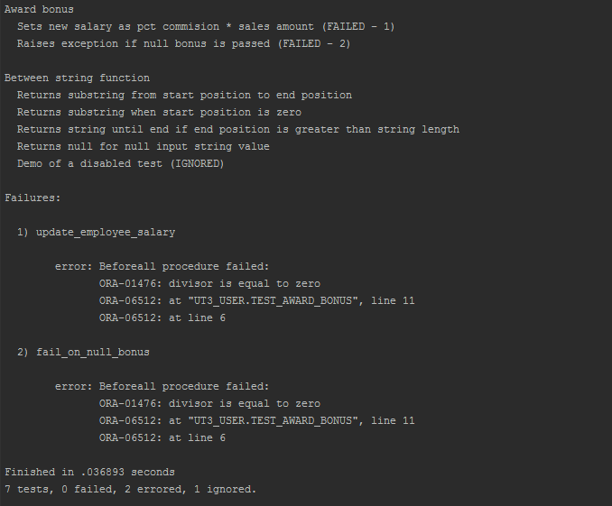
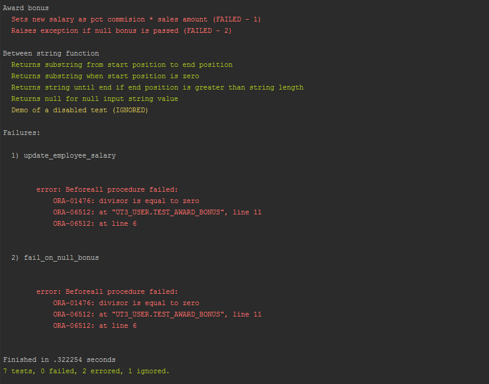
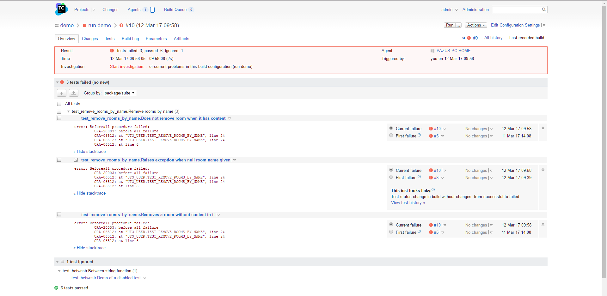

utPLSQL provides the following reporting formats.

#Documentation reporter

The `ut_documentation_reporter` is the default reporting format used by the framework.
It provides a human readable test results.

To invoke tests with documentation reporter use one of following calls from sql console (SQLPlus)  

`exec ut.run();`

`exec ut.run(ut_documentation_reporter());`

You may also invoke unit tests directly from command line by calling.

`sqlplus /nolog @ut_run %user%/%pass%@%dbsid%`

Invoking tests from command line tool `ut_run.sql` allows you to track progress of test execution.
In that case, the documentation reporter will provide information about each test that was executed as soon as it's execution finishes.
For more details on using the `ut_run.sql` script look into [ut_run.sql](ut_run-script.md) documentation.

The `ut_documentation_reporter` doesn't accept any arguments.

Example outputs from documentation reporter.

The documentation report provides the following information.
- Test suite name or test package name  (nested with suitepath if suitepath is used)
- Test description name or test procedure name
- Information about test failing `(FAILED - n)` 
- Information about disabled test `(IGNORED)` 
- List of all errors and failures
- Summary with total number of tests, number of tests with status and timing for the execution 

##Color output from documentation reporter

When invoking tests with documentation reporter and your command line supports ANSICONSOLE (default on Unix), you can obtain the coloured outputs from the documentation reporter.

To invoke tests with documentation reporter in color mode use one of following calls.  

`exec ut.run(a_color_console=>true);`

`exec ut.run(ut_documentation_reporter(), a_color_console=>true);`

Example outputs from documentation reporter.

#XUnit reporter

Most of continuous integration servers (like Jenkins) are capable of consuming unit test execution results in [XUnit/JUnit](https://en.wikipedia.org/wiki/XUnit) format.
The `ut_xunit_reporter` is producing outcomes as XUnit-compatible XML unit test report, that can be used by CI servers to display their custom reports and provide metrics (like tests execution trends).

Invocation of tests with XUnit reporter.  

`exec ut.run(ut_xunit_reporter());`

The `ut_xunit_reporter` doesn't accept any arguments.

Example of xunit report integrated with [Jenkins CI](https://jenkins.io/)

Example of failure report details
 

#Teamcity reporter

[Teamcity](https://www.jetbrains.com/teamcity/) is a CI server by Jetbrains. The CI has it's own format of reporting that allows tracking of progress of a CI step/task as it executes.
The format developed by Jetbrains is supported by utPLSQL with `ut_teamcity_reporter`.

Invocation of tests with Teamcity reporter.  

`exec ut.run(ut_teamcity_reporter());`

The `ut_teamcity_reporter` doesn't accept any arguments.

Example of unit test report from Teamcity CI server.

Example of failure report details
 

# Coverage reporters

utPLSQL comes with a set of build-in coverage reporters. Have a look into the [coverage documentation](coverage.md) to learn more about them.
